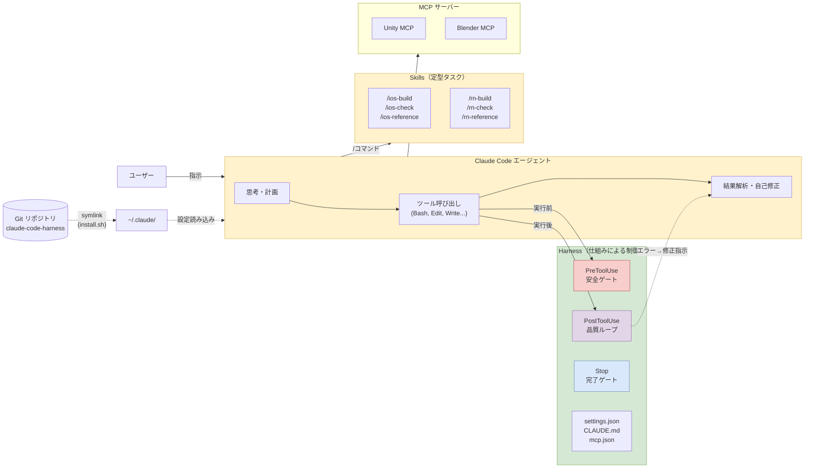

# Claude Code Harness

Claude Code（Anthropic の CLI エージェント）の設定・フック・スキルを一元管理するリポジトリ。

## Harness Engineering とは？

**Harness（ハーネス）= エージェントを制御する仕組み全体** のこと。

Claude Code は強力な AI エージェントだが、そのまま使うと以下の問題が起きる：

- 危険なコマンド（`rm -rf`）を実行してしまう
- リンター設定を勝手に変更してエラーを消す
- `.env` など機密ファイルを読み書きする
- 「完了」と宣言するがテストを通していない

**Harness Engineering** は、プロンプト（お願い）ではなく **仕組み（Hooks・リンター・テスト）で品質を強制する** アプローチ。

> 同じモデルでも、ハーネスを変えるだけで劇的に結果が変わる

詳しくは [docs/what-is-harness-engineering.md](docs/what-is-harness-engineering.md) を参照。

## システム全体図

> draw.io の詳細図は [docs/diagrams/](docs/diagrams/) にあります



### 図の読み方

**3つのレイヤー** で Claude Code エージェントを制御している：

| レイヤー | 色 | 役割 | 現在の状態 |
|---------|---|------|----------|
| **PreToolUse**（安全ゲート） | 赤 | ツール実行**前**に危険操作をブロック | `safe_command.py` 稼働中 |
| **PostToolUse**（品質ループ） | 紫 | ツール実行**後**にリンター/フォーマッターを自動実行し、エラーをエージェントにフィードバック | 今後追加予定 |
| **Stop**（完了ゲート） | 青 | エージェントが「完了」と宣言したときにテストを自動実行、不合格なら続行させる | 今後追加予定 |

**データの流れ：**

1. ユーザーが指示を出す
2. エージェントが思考し、ツールを呼び出す
3. **PreToolUse** が実行前にチェック（`rm -rf` → ブロック）
4. ツールが実行される
5. **PostToolUse** がリンターを実行し、エラーがあればエージェントに戻す
6. エージェントが自己修正して再試行
7. 完了宣言時に **Stop** がテストを実行

**周辺要素：**
- **Skills** — `/ios-build` などのスラッシュコマンドで定型タスクを実行
- **MCP** — Unity Editor や Blender との接続
- **Git リポジトリ** — `install.sh` で `~/.claude/` にシンボリックリンク作成、設定を Git 管理

## このリポジトリの構成

```
claude-code-harness/
├── README.md                 ← このファイル
├── settings.json             ← Claude Code のメイン設定（Hooks・権限・プラグイン）
├── CLAUDE.md                 ← グローバル指示（全プロジェクト共通ルール）
├── mcp.json                  ← MCP サーバー設定（Unity MCP, Blender MCP）
├── hooks/
│   └── safe_command.py       ← PreToolUse フック（危険コマンド検出）
├── skills/                   ← Claude Code スキル定義
│   ├── ios-build/            ← iOS ビルド & テスト
│   ├── ios-check/            ← iOS コードエラー検出
│   ├── ios-reference/        ← Apple 公式ドキュメント参照
│   ├── rn-build/             ← React Native ビルド & テスト
│   ├── rn-check/             ← React Native コードチェック
│   └── rn-reference/         ← React Native ドキュメント参照
├── docs/
│   ├── what-is-harness-engineering.md  ← Harness Engineering 解説
│   ├── hooks-guide.md                  ← Hooks システム詳細ガイド
│   ├── skills-guide.md                 ← Skills 作成・管理ガイド
│   └── diagrams/
│       ├── system-overview.drawio      ← システム全体図
│       └── hook-lifecycle.drawio       ← Hook ライフサイクル図
└── install.sh                ← セットアップスクリプト
```

## クイックスタート

### 1. リポジトリをクローン

```bash
cd ~/Documents/dsgarageScript
git clone <repo-url> claude-code-harness
```

### 2. インストール（シンボリックリンク作成）

```bash
cd claude-code-harness
./install.sh
```

これにより `~/.claude/` 配下の設定ファイルがこのリポジトリへのシンボリックリンクに置き換わる。

### 3. 動作確認

```bash
claude  # Claude Code を起動して設定が反映されているか確認
```

## 各ファイルの役割

### settings.json — メイン設定

Claude Code の動作を制御する中核ファイル。3つのセクションで構成：

| セクション | 役割 | 例 |
|-----------|------|-----|
| `permissions` | ツールの許可/拒否ルール | `.env` の読み取り拒否 |
| `hooks` | ツール実行前後の自動処理 | Bash 実行前に危険コマンドチェック |
| `enabledPlugins` | プラグイン有効化 | Swift LSP |

### CLAUDE.md — グローバル指示

全プロジェクト共通のルール。現在は言語ルール（日本語で作業）のみ。
**50行以下** を目標に、詳細はプロジェクト別の CLAUDE.md に委譲する。

### hooks/safe_command.py — 安全フック

Bash コマンド実行前に自動起動し、以下をブロック：

- `sudo`、`rm -rf`、`chmod 777`
- `curl | bash`（リモートスクリプト実行）
- 保護ディレクトリ（`/etc`, `/usr`, `Assets` 等）の削除
- ホームディレクトリ直下の削除

### skills/ — スキル定義

`/ios-build` のようにスラッシュコマンドで呼び出せる定型タスク。

| スキル | 用途 |
|--------|------|
| `/ios-build` | XcodeGen → ビルド → テスト実行 |
| `/ios-check` | `@Observable` と `#if` 非互換など iOS 固有パターン検出 |
| `/ios-reference` | Apple 公式ドキュメント参照 |
| `/rn-build` | Expo プロジェクトの型チェック・テスト |
| `/rn-check` | 認証トークン参照ミス・ルーティング不整合など検出 |
| `/rn-reference` | React Native/Expo ドキュメント参照 |

### mcp.json — MCP サーバー設定

外部ツール（Unity Editor、Blender）との接続設定。

## 設定変更のワークフロー

1. このリポジトリ内のファイルを編集
2. 変更をコミット
3. シンボリックリンク経由で `~/.claude/` に自動反映

```bash
# 例：新しい禁止パターンを追加
vim hooks/safe_command.py
git add hooks/safe_command.py
git commit -m "feat: docker系の危険コマンドをブロック対象に追加"
```

## 今後の拡張予定（Harness Engineering ロードマップ）

記事 [Harness Engineering Best Practices 2026](https://nyosegawa.github.io/posts/harness-engineering-best-practices-2026/) に基づく段階的導入：

### Week 1（現在地）
- [x] 設定ファイルの Git 管理
- [x] PreToolUse フック（危険コマンドブロック）
- [ ] PostToolUse フック（自動リント・フォーマット）
- [ ] ADR（Architecture Decision Records）の導入

### Week 2-4
- [ ] Stop フック（完了時テスト自動実行）
- [ ] PreToolUse フック（リンター設定保護）
- [ ] セッション間起動ルーチンの標準化

### Month 2-3
- [ ] カスタムリンター（修正指示入りエラーメッセージ）
- [ ] E2E テストツール導入
- [ ] プロジェクト別 CLAUDE.md のスリム化

## 参考資料

- [Harness Engineering Best Practices 2026](https://nyosegawa.github.io/posts/harness-engineering-best-practices-2026/) — ハーネスエンジニアリング総合解説
- [The Complete Guide to Building Skills for Claude](https://docs.anthropic.com/) — Anthropic 公式スキル構築ガイド（29ページ PDF）
- [anthropics/skills](https://github.com/anthropics/skills) — Anthropic 公式スキルリポジトリ
- [Claude Code Hooks ドキュメント](https://docs.anthropic.com/en/docs/claude-code/hooks)
- [Claude Code Skills ドキュメント](https://docs.anthropic.com/en/docs/claude-code/skills)
